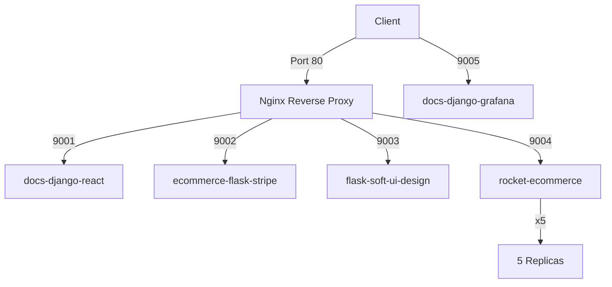
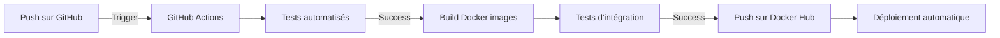

# Projet E4 WMD Docker - Documentation


## Table des matières

- [Vue d'ensemble](#vue-densemble)

- [Prérequis](#prérequis)

- [Architecture](#architecture)

- [Applications déployées](#applications-déployées)

- [Configuration](#configuration)

- [Installation et déploiement](#installation-et-déploiement)

- [Réponses aux questions](#réponses-aux-questions)


## Vue d'ensemble


Ce projet consiste en le déploiement de 5 applications web dans un environnement Docker, avec mise en place d'un reverse proxy et gestion de la haute disponibilité.


## Prérequis


- Docker Engine

- Docker Compose

- Git

- Compte Docker Hub

- Nginx (pour le reverse proxy)


## Architecture





## Applications déployées


1. docs-django-grafana (Port: 9005:8000)

   - Application accessible directement sans reverse proxy

   - [Lien GitHub](https://github.com/app-generator/docs-django-grafana)


2. docs-django-react (Port: 9001:8000)

   - [Lien GitHub](https://github.com/app-generator/docs-django-react)


3. ecommerce-flask-stripe (Port: 9002:5000)

   - [Lien GitHub](https://github.com/app-generator/ecommerce-flask-stripe)


4. flask-soft-ui-design (Port: 9003:5000)

   - [Lien GitHub](https://github.com/app-generator/flask-soft-ui-design)

   - Configuré avec 5 replicas pour la haute disponibilité


5. rocket-ecommerce (Port: 9004:8000)

   - [Lien GitHub](https://github.com/app-generator/rocket-ecommerce)


## Configuration


### docker-compose.yml

```yaml

version: '3.8'


services:

  reverse-proxy:

    image: nginx:alpine

    ports:

      - "80:80"

    volumes:

      - ./nginx.conf:/etc/nginx/nginx.conf:ro

    depends_on:

      - docs-django-react

      - ecommerce-flask

      - flask-soft-ui

      - rocket-ecommerce


  docs-django-grafana:

    image: ${DOCKER_USERNAME}/docs-django-grafana:latest

    build: 

      context: ./docs-django-grafana

      dockerfile: Dockerfile

    ports:

      - "9005:8000"


  docs-django-react:

    image: ${DOCKER_USERNAME}/docs-django-react:latest

    build:

      context: ./docs-django-react

      dockerfile: Dockerfile

    expose:

      - "8000"


  ecommerce-flask:

    image: ${DOCKER_USERNAME}/ecommerce-flask-stripe:latest

    build:

      context: ./ecommerce-flask-stripe

      dockerfile: Dockerfile

    expose:

      - "5000"


  flask-soft-ui:

    image: ${DOCKER_USERNAME}/flask-soft-ui-design:latest

    build:

      context: ./flask-soft-ui-design

      dockerfile: Dockerfile

    deploy:

      replicas: 5

    expose:

      - "5000"


  rocket-ecommerce:

    image: ${DOCKER_USERNAME}/rocket-ecommerce:latest

    build:

      context: ./rocket-ecommerce

      dockerfile: Dockerfile

    expose:

      - "8000"

```


### nginx.conf

```nginx

events {

    worker_connections 1024;

}


http {

    upstream flask-soft-ui {

        server flask-soft-ui:5000;

    }


    server {

        listen 80;


        location /django-react/ {

            proxy_pass http://docs-django-react:8000/;

        }


        location /ecommerce-flask/ {

            proxy_pass http://ecommerce-flask:5000/;

        }


        location /flask-soft-ui/ {

            proxy_pass http://flask-soft-ui/;

        }


        location /rocket-ecommerce/ {

            proxy_pass http://rocket-ecommerce:8000/;

        }

    }

}

```


## Installation et déploiement


1. Cloner le repository

```bash

git clone <repository-url>

cd <repository-name>

```


2. Configuration des variables d'environnement

```bash

export DOCKER_USERNAME=votre-username

```


3. Construction et déploiement des conteneurs

```bash

docker-compose up --build -d

```


4. Publication des images sur Docker Hub


```bash

docker-compose push

```


## Optimisation des images


Pour réduire la taille des images, nous utilisons les techniques suivantes :

- Images de base légères (alpine)

- Multi-stage builds

- Minimisation des layers

- Nettoyage des caches et fichiers temporaires


Exemple de Dockerfile optimisé:

```dockerfile

# Stage de build

FROM python:3.9-alpine as builder


WORKDIR /app

COPY requirements.txt .

RUN pip wheel --no-cache-dir --no-deps --wheel-dir /app/wheels -r requirements.txt


# Stage final

FROM python:3.9-alpine


WORKDIR /app


# Copie des wheels du stage de build

COPY --from=builder /app/wheels /wheels

COPY --from=builder /app/requirements.txt .


# Installation des dépendances

RUN pip install --no-cache /wheels/*


# Copie du code

COPY . .


CMD ["python", "manage.py", "runserver", "0.0.0.0:8000"]

```


## Réponses aux questions


### Pourquoi utiliser Docker dans ce projet ?

Docker est utilisé dans ce projet pour plusieurs raisons :

1. Portabilité : Les applications sont encapsulées avec leurs dépendances

2. Isolation : Chaque application fonctionne dans son propre conteneur

3. Scalabilité : Facilite la réplication des services (comme démontré avec les 5 replicas)

4. Standardisation : Uniformise le déploiement des applications

5. Rapidité : Déploiement rapide et reproductible


### Docker dans la méthodologie DevOps

Docker s'inscrit parfaitement dans la méthodologie DevOps car il :

- Facilite la collaboration entre développeurs et opérationnels

- Automatise le déploiement

- Garantit la cohérence entre les environnements

- Permet l'intégration continue et le déploiement continu (CI/CD)

- Simplifie la maintenance et les mises à jour


### Workflow de test et publication automatique





Étapes du workflow :

1. **Trigger** : Push sur la branche main ou création d'une PR

2. **Tests** : Exécution des tests unitaires et d'intégration

3. **Build** : Construction des images Docker optimisées

4. **Publication** : Push des images sur Docker Hub

5. **Déploiement** : Mise à jour automatique des environnements


Exemple de workflow GitHub Actions :

```yaml

name: CI/CD Pipeline


on:

  push:

    branches: [ main ]

  pull_request:

    branches: [ main ]


jobs:

  test-and-publish:

    runs-on: ubuntu-latest

    steps:

      - uses: actions/checkout@v2


      - name: Run tests

        run: |

          docker-compose -f docker-compose.test.yml up --build --exit-code-from tests


      - name: Login to Docker Hub

        uses: docker/login-action@v1

        with:

          username: ${{ secrets.DOCKER_HUB_USERNAME }}

          password: ${{ secrets.DOCKER_HUB_ACCESS_TOKEN }}


      - name: Build and push

        run: |

          docker-compose build

          docker-compose push

```

